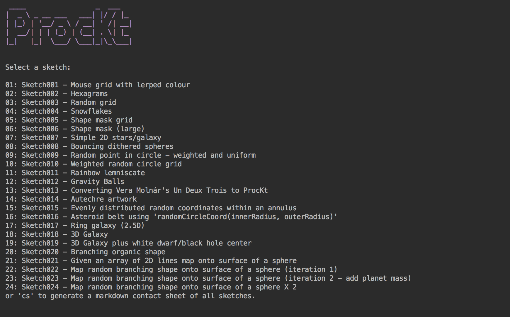
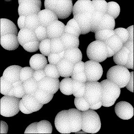
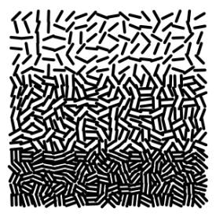
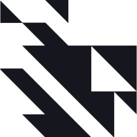
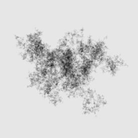
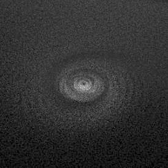

# ProcKt Template for Jetbrains IDEA

A simple (and completely unofficial) [Kotlin](https://kotlinlang.org/) wrapper for [Processing](https://processing.org/). Clone, open in [Jetbrains IDEA](https://www.jetbrains.com/idea/), and start sketching. Use with [ProcKtPlugin](https://github.com/fiskurgit/ProcKtPlugin) for easier and quicker sketch developing.

## Usage

Run a sketch in three ways:
* The default run configuration displays the menu below, enter a sketch number in the terminal.
* Enter a sketch number as an program argument in the run configuration (to run the same sketch every time).
* [Install the plugin](https://github.com/fiskurgit/ProcKtPlugin) (to hop between sketches while coding).



This is just a personal project I use for my own sketches, not a whole lot of thought has gone into it.

## FAQ

* _Why don't you..._ - see above
* _Why do you..._ - see above
* _You should..._ - see above
* _Can you..._ - see above
* _This is terrible_ - see above

```
class Sketch: KApplet() {

    override fun settings() {
        size(600, 600)
        super.settings()
    }

    override fun draw() {
        background(BLACK)
        stroke(WHITE)
        line(0, 0, width, height)
    }
}

```

## Note.
Processing requires JDK8, OpenJDK is fine: `brew cask install adoptopenjdk8`

## Examples

See [sketches](https://github.com/fiskurgit/ProcKtTemplate/tree/master/src/prockt/sketches).



## Licence

The Processing core libraries are distributed under a [GPL licence](https://github.com/processing/processing/blob/master/license.txt) -  [this project is too](LICENSE.md).

## Additions

This project adds a few convenience features to the standard Processing experience:

* Dithering algorithms, I've included a port of [DitherKt](https://github.com/fiskurgit/DitherKt) that works with Processing, see [Sketch012](https://github.com/fiskurgit/ProcKtTemplate/blob/master/src/prockt/sketches/Sketch012.kt)
* _Command-S_ on OSX will show a save dialog for a screenshot (note. may appear behind sketch window).
* _Command-P_ on OSX will show a save dialog for a vector pdf export when `startPdf()` and `endPdf()` have been wrapped around a drawing block (note. may appear behind sketch window).

## Grid

A common feature of sketches (at least of [fiskurgit](https://github.com/fiskurgit)'s) is to have random variants of some code displayed in a two dimensional grid. A simple API has been added to make this easier:

Initialise a grid using a class default constructor (or manage this yourself using `grid.addOccupant(someObject)`):

```kotlin
override fun setup() {
    grid.prepopulate(BasicCell::class)
}
```

Utility methods for working with cells:
* Cell diameter: `val cellDiam = grid.cellDiam()`
* Origin screen coordinates: `val originPVector = grid.cellOrigin(index)`
* Get cell at screen coordinates: `val cell = grid.occupantAt<BasicCell>(mouseX, mouseY)`


The grid default is 8x8, override this in your sketch settings:

```kotlin
override fun settings() {
    size(600, 600)
    grid.columns = 4
    grid.rows = 4
    super.settings()
}
```

Update each cell in a grid during redraw:

```kotlin
override fun draw() {
    background(BLACK)

    grid.occupants<BasicCell>().forEachIndexed { index, cell ->
        cell.draw(this, grid.cellOrigin(index), grid.cellDiam())
    }
}
```

A cell can be anything at all, but here's a simple example to give an idea:


```kotlin
import prockt.KApplet
import prockt.circle
import processing.core.PVector

class BasicCell {

    fun draw(kappl: KApplet, origin: PVector, diam: Float, color: Int){
            kappl.fill(color)
            kappl.circle(origin.x, origin.y, diam)
    }
}

```
